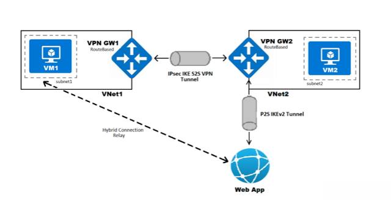

# Architecture Details

## Network Topology

### Virtual Network Design



## Security Architecture

### Service Endpoints
- **Enabled on**: sub1 (VNet1) and sub2a (VNet2)
- **Service**: Microsoft.Sql
- **Purpose**: Secure database traffic within VNet backbone

### Firewall Configuration
```powershell
# Enabled on both VMs for testing
netsh advfirewall firewall add rule name="ICMP Allow incoming V4 echo request" 
dir=in action=allow enable=yes protocol=icmpv4:8,any

VPN Security
S2S: IPsec/IKE with shared key authentication
P2S: SSTP with certificate-based authentication
Root Certificate: P2SRootCert (SHA-256, 2048-bit)

Connection Flow
Scenario 1: VM1 ↔ VM2 Communication

VM1 (172.17.0.4) 
    → VNet1 
    → GW1 
    → IPsec Tunnel 
    → GW2 
    → VNet2 
    → VM2 (172.18.0.4)

Scenario 2: Web App → VM1 Communication
Web App 
    → VNet Integration 
    → VNet2 
    → GW2 (P2S) 
    → S2S Tunnel 
    → GW1 
    → VNet1 
    → VM1 (172.17.0.4)

Address Space Planning

Network               CIDR Block                Purpose               
VNet1                 172.17.0.0/16         Primary cloud network
VNet2                 172.18.0.0/16         Simulated on-premises
P2S Pool              172.19.0.0/24         VPN client addresses

Note: All address spaces are non-overlapping to ensure proper routing.